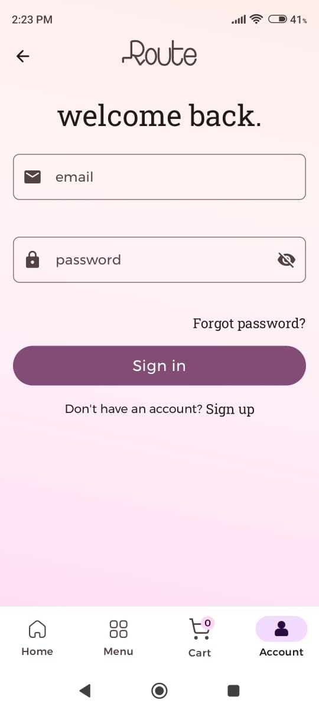

# 📦 Route Store

A **production-ready e-commerce app** designed purely for learning and
demonstration purposes.
This app offers a real shopping experience but does not sell or process any actual products.

---

## 🎥 video

https://github.com/user-attachments/assets/2ca1e961-6cea-4e3c-8faf-f5cd589cac06

---

## 🛠️ Features

- **📋 Product Listings**  
  Browse an extensive catalog of products across multiple categories.

- **🔍 Search Functionality**  
  Quickly find items using the intuitive search bar.

- **🛒 Shopping Cart**  
  Add products to your cart and review your selections before "checkout."

- **📱 Product Details**  
  View detailed descriptions, pricing, and high-quality images for each product.

- **🚀 Offline-First Design**  
  Access your data seamlessly, even without an internet connection.

- **⚡ Efficient Performance**  
  Smooth navigation and data loading, optimized with modern libraries.

---

## 📸 Screenshots

### Splash Screen

 

### Home Screen

 

### Account Screen

 

### Cart Screen

 

### Empty Cart Screen

 

### Menu Screen

 

### Orders List Screen

 

### Details Screen

 

### Sign In Screen

 

### Sign Up Screen

 

### Profile Screen

 

### OTP Screen

 

---

## 🎯 Objective

The **Route Store** app was developed to:

1. **Showcase Android Development Skills**
    - Jetpack Compose
    - MVVM / MVI
    - Clean Architecture
    - Dependency Injection with Hilt
    - RESTful Api
    - Offline-First Design

2. **Demonstrate Use of Popular Android Libraries**
    - **Coil**: Image loading
    - **Proto DataStore**: Persistent storage
    - **Room Database**: Local data management
    - **Retrofit**: Network requests
    - **OkHttp**: HTTP client
    - **WorkManager**: Background tasks
    - **Coroutines**: Asynchronous programming

3. **Highlight UI/UX Design**
    - Focus on user-friendly interfaces and engaging layouts.

---

## ⚠️ Disclaimer

This app is **strictly for demonstration purposes**:

- **No real products** are sold.
- **No payment processing** is integrated.

---

## 🚀 Installation

### Step 1: Download the APK

📥 Download the latest APK from
the [Releases Section](https://github.com/Hossam-Elgmmal/route-store/releases).

### Step 2: Install the App

1. On your Android device, allow installation from unknown sources

2. Open the downloaded APK file and install the app.

### Step 3: Explore!

Launch the app and enjoy exploring the **fake e-commerce experience**.

---

## 🗒️ Feedback

Would love to hear your thoughts! Share your suggestions or report any issues for future
improvements.

---

### 🛍️ Happy Shopping (Fictionally)!
